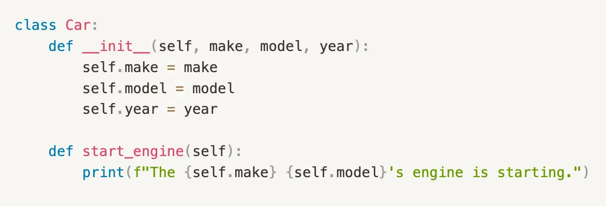
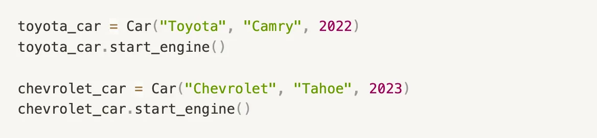
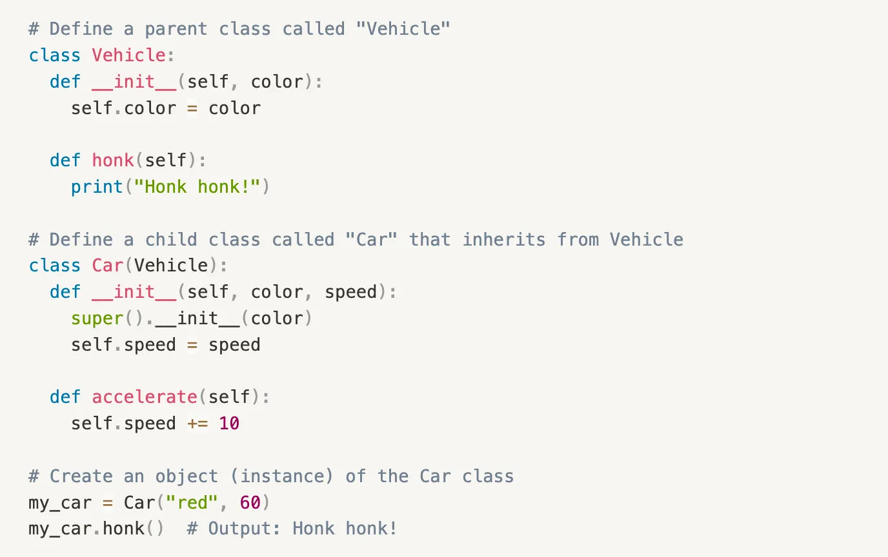
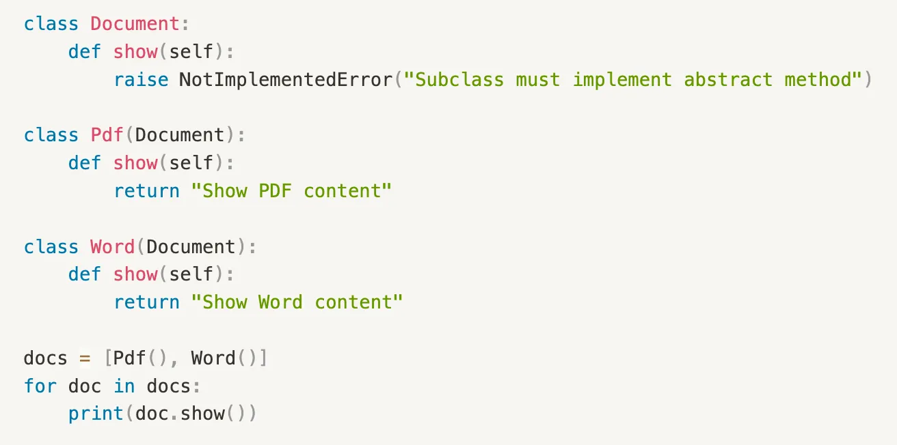
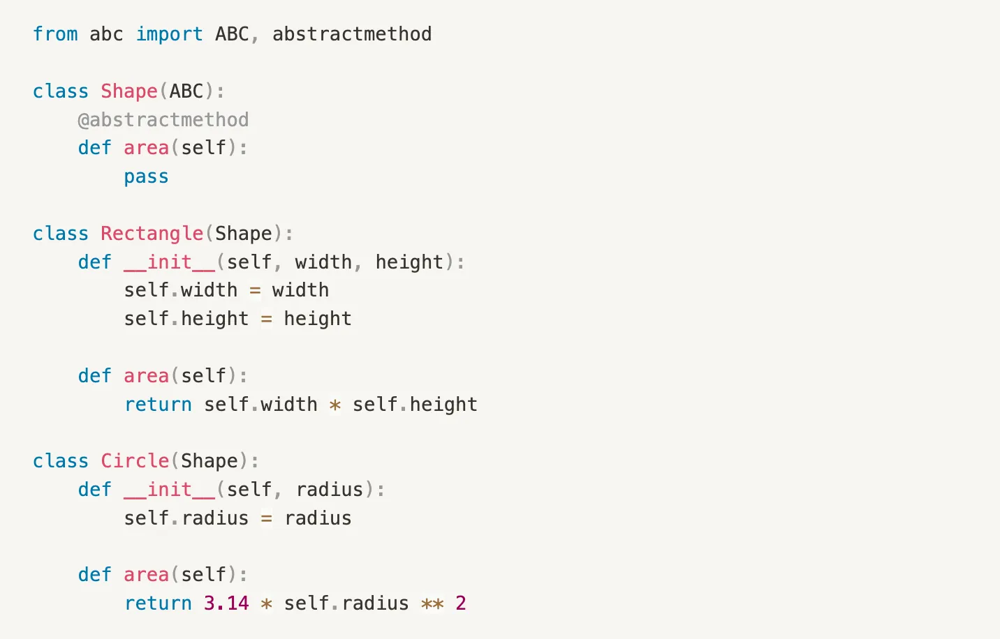

# Object Oriented Programming
## Description 


Object-Oriented Programming (OOP) is a fundamental concept in software development that revolves around the concept of classes and objects.

Learning OOP helps us create efficient, modular, and maintainable code.

In this article, we will explore core OOP concepts using easy to understand code examples.

## 1. Classes and Objects
```
A class is a blueprint or template that defines the properties and behavior of an object. An Object is an instances of a class, created using the class definition.
```
Here's an example of a class definition in Python:

In this example, the Car class is a blueprint that defines the properties of a car.

We create two objects, toyota_car and chevrolet_car which are instances of the Car class. Both car objects can invoke start_engine() method using their own values for the make, model and year properties.


## 2. Encapsulation
```
Encapsulation is the concept of hiding the implementation details of an object from the outside world and only exposing the necessary information through public methods.
```
Encapsulation helps protect the object's internal state from external interference and misuse.

In Python, you can achieve encapsulation using private attributes and methods, denoted by a double underscore prefix (__).


In this example, the __account_number and __balance attributes are private, meaning it can't be accessed directly from outside the class. We interact with it through the deposit, withdraw, and get_balance methods.

## 3. Inheritance
```
Inheritance is a mechanism that allows a class to inherit properties and methods from another class, called the superclass or parent class.
```
The class that inherits is called the subclass or child class.

The child class inherits all the fields and methods of the parent class and can also add new fields and methods or override the ones inherited from the parent class.

Inheritance promotes code reuse and helps create a hierarchical structure.

Let’s say we have a parent Vehicle class with a method named honk().



The Car class inherits the color attribute and the honk method from the Vehicle class promoting code reuse. The Car class also adds its own attributes and methods, such as speed and accelerate.

## 4. Polymorphism
```
Polymorphism is the ability of an object to take on multiple forms.
```
It enables you to write generic code that can work with objects of multiple types, as long as they share a common interface.

A common way to achieve polymorphism is method overriding.

Method overriding is when a subclass provides a specific implementation of a method that is already defined in its parent class.

For example, let’s say we have an interface Document which defines a method show().


Each subclass (Pdf, Word) of Document implement the show method differently (method overriding), but the interface remains consistent giving the ability to iterate over both the classes using a single for loop.

## 5. Abstraction
```
Abstraction is the concept of showing only the necessary information to the outside world while hiding unnecessary details.
```
Abstraction helps to simplify complex systems and focus on the essential features.

In Python, you can achieve abstraction using abstract base classes (ABC) and abstract methods.

Let’s say we have an abstract base class called Shape. The Shape class is marked as an abstract class by inheriting from the ABC class (Abstract Base Class).

Inside the Shape class, we define an abstract method called area() using the @abstractmethod decorator.



The Rectangle and Circle classes inherit from the Shape class.

They provide their own implementations of the area() method specific to their shapes. Note that the implementation details are hidden from the outside world, and only the interface defined by the abstract class is exposed.

These are the basic principles of Object Oriented Programming.

By applying these concepts, you can write more organized, reusable, and maintainable code.