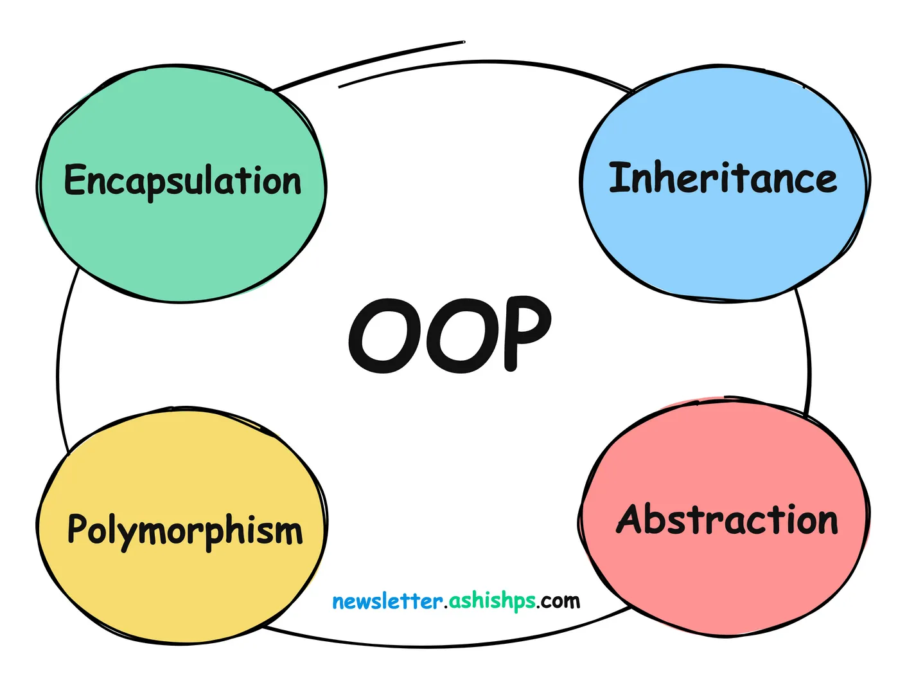

# Object Oriented Programming
## Description 


Object-Oriented Programming (OOP) is a fundamental concept in software development that revolves around the concept of classes and objects.

Learning OOP helps us create efficient, modular, and maintainable code.

In this article, we will explore core OOP concepts using easy to understand code examples.

## 1. Classes and Objects
```A class is a blueprint or template that defines the properties and behavior of an object. An Object is an instances of a class, created using the class definition.```
Here's an example of a class definition in Python:

In this example, the Car class is a blueprint that defines the properties of a car.
